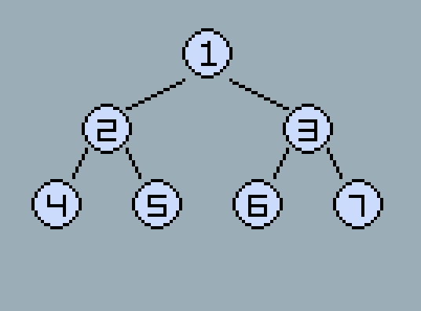

广度优先是遍历图的方式之一，在游戏开发中，广度优先常常用在路径搜索，例如自动寻路、AI行动、战棋走格子。著名的A*算法也是基于广度优先的算法。

<!-- more -->

## 什么是广度优先遍历?
广度优先遍历就是从一个起始点开始，先遍历周围的子节点，再遍历子节点周围的节点，按顺序层层递进，直到全部遍历完。

## 用树形结构解释
树也是图的一种，使用二叉树来展示更加简单、容易理解，从根节点开始遍历，如下图：

得到的结果是[1,2,3,4,5,6,7]

## 代码实现
实现思路为使用一个队列来维护遍历的顺序，先根再左右子节点，依次添加到队尾，从队首逐个拿取。
```csharp
// 创建一个节点用于表示二叉树的结构
class Node {
	public int value = 0; // 值
	public Node left = null; // 左子节点
	public Node right = null; // 右子节点
}
```
```csharp
// 输出广度优先遍历的结果
void PrintBFS(Node root) {
	// 保存遍历顺序的队列
	var queue = new Queue<Node>();
	// 入队根节点
	queue.Enqueue(root);
	while (queue.Count > 0) {
		// 出队一个节点
		var node = queue.Dequeue();

		// 打印当前节点的值
		Console.Write(node.value);

		// 将左子节点入队
		if (node.left != null) {
			queue.Enqueue(node.left);
		}
		// 将右子节点入队
		if (node.right != null) {
			queue.Enqueue(node.right);
		}
	}
}
```
```csharp
void main() {
	// 创建上图所示的二叉树
	var nodes = new Node[7];
	for (var i = 0; i < 7; ++i) {
		nodes[i] = new Node();
		nodes[i].value = i + 1;
	}
	// node[0]是根节点，并分配所有子节点
	nodes[0].left = nodes[1];
	nodes[0].right = nodes[2];
	nodes[1].left = nodes[3];
	nodes[1].right = nodes[4];
	nodes[2].left = nodes[5];
	nodes[2].right = nodes[6];

	// 调用输出
	PrintBFS(nodes[0]); // 结果：1234567
}
```

## 从A->B的路径
有了上面的基础，这个就比较容易了，可以写一个方法，传入两个参数，在遍历时找到目标后停止遍历，并返回结果就好了

最后，在地图应用中，节点之间会有更加复杂的连接关系，实现思路都是一样的。