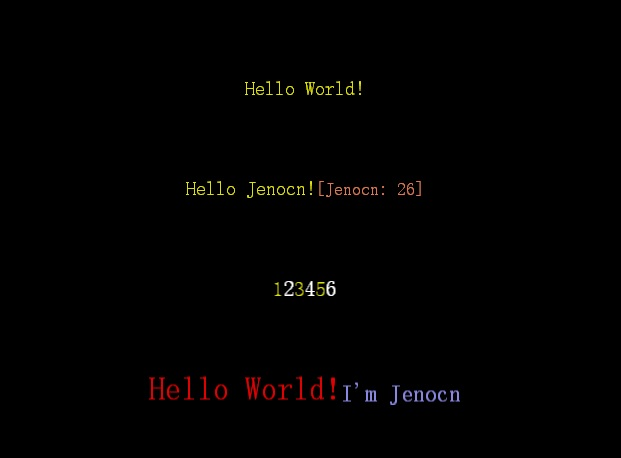

最近负责开发的模块中有一个显示公告的需求,公告中特殊的文字需要变色,很明显,使用富文本能够很轻松的实现,但是,直接写死很明显不是我的方式,于是决定写一套解析语法,以应变以后其他地方再出现这样的需求.

本文从以下几点讲解:

- 分析和设计
- 实现
- 源码

<!-- more -->

## 分析和设计  
1. 我希望使用的方式非常简单,并且将解析和`RichText`的创建分离,这样的好处是以后可以随时替换显示的方式,也便于维护,这样一来,显示部分非常简单,就是根据解析后生成的数据来逐一创建就可以了.
2. 字符串解析部分,将通过`|`来划分每个`Element`字符串,然后每个字符串中再使用`;`来划分具体的内容以及命令,命令采用`()`包括的方式,如果是普通文本,不需要加命令语法
3. 支持风格声明,即声明一个或多个样式,在这一条字符串中,都可以通过样式的变量名来引用样式,这样在一段字符串中,需要分割多处显示同一种样式的时候,减小字符串长度
4. 颜色中`r` `g` `b` `a`都分别以一个字符来表示,从`0 ~ f`
5. 除了命令的语法部分,其他部分都能支持变量,变量采用`{{ }}`的方式来声明,变量在代码中设置之后以替换为需要显示的数据
6. 命令设计
```
(common)styleName; // 用于声明一段样式
(l)styleName; // 用于引用一段样式, l->link
(s)20; // 用于声明一个字体大小, s->size
(c)ffff; // 用于声明一个颜色, c->color
(i)filename.png; // 用于声明一张图片, i->image
(f)family.ttf; // 用于声明使用的字体, f->family
{{param}} // 用于声明一个变量,以便在代码中修改
```
预期的使用情况就是:
```
// 常规方式,表示创建两个文本和一个图片,第一个红色32号msg.ttf字体,第二个蓝色24号字体默认字体,第三创建avatar.jpg图片
Hello World!;(s)32;(c)f00f(f)msg.ttf | I'm Jenocn;(s)24;(c)00ff | (i)avatar.jpg
// 样式在分割比较多并且不集中显示一种样式的情况下使用
(common)style1;(c)ff0f;(s)20 | (common)style2;(s)22 | 1;(l)style1 | 2;(l)style2 | 3;(l)style1 | 4;(l)style2 | 5;(l)style1 | 6;(l)style2
// 变量
1.替换文本,代码中可以修改声明的 name 和 age 两个变量
Hello {{name}}!;(s)20;(c)ff0f | [{{name}}: {{age}}];(s)18;(c)f85f
2.结合样式使用,代码中通过修改 style 的变量为前面声明的变量,已达到变化
(common)style1;(c)ff0f;(s)20 | (common);style2;(s)22 | Hello World!;(l){{style}}
```

## 实现  
代码中使用必须要简单:
需要一个`ParseRichTool`类用于解析字符串
```C++
// 传入源字符串,解析并返回需要的数据
std::vector<std::shared_ptr<ParseRichData>> Parse(const std::string& destStr);
// 设置变量
void SetParam(const std::string& key, const std::string& value);
```
需要一个字符串工具,我自己实现了一个`StringToCocos`类,包含了一些常用的字符串操作方法
```C++
// 该类中需要用到的方法
// 替换字符串
static std::string replace(const std::string& str, const std::string& find, const std::string& dest);
// 切割字符串
static std::vector<std::string> split(const std::string& str, char splitWord, bool bTrim = false);
```
需要一个`ParseRichData`结构体用于保存解析后的单个元素数据
```C++
// 基本的数据
ParseRichType type{ ParseRichType::None }; // 类型
std::string text; // 文本
std::string family; // 字体
cocos2d::Color4B color{ cocos2d::Color4B::WHITE }; // 颜色
int fontSize{ 20 }; // 字体大小
std::string filename; // 图片路径,只有当类型为图片时才有意义
```
需要一个`ParseRichType`枚举用于区分类型和方便扩展
```C++
enum class ParseRichType
{
    None = 0,
    Text,
    Image,
};
```

具体实现其实就是字符串的切割和命令的解析,所以没什么需要详细讲的,贴一个段测试代码,直接copy到cocos中就可以看到效果
```C++
bool init()
{
    ParseRichTool tool;
    tool.SetParam("name", "Jenocn");
    tool.SetParam("age", "26");
    tool.SetParam("style", "style1");

    auto func = [](const decltype(tool.Parse(""))& data, int index)->RichText* {
        auto richText = RichText::create();
        for (auto d : data)
        {
            if (d->type == ParseRichType::Text)
            {
                auto element = RichElementText::create(0, Color3B(d->color), d->color.a, d->text, d->family, d->fontSize);
                richText->pushBackElement(element);
            }
        }
        richText->setPosition(Vec2(500, index * 100));
        return richText;
    };

    auto data1 = std::move(tool.Parse("Hello World!;(s)32;(c)f00f(f)msg.ttf | I'm Jenocn;(s)24;(c)99ff | (i)avatar.jpg"));
    addChild(func(data1, 1), INT_MAX);
    auto data2 = std::move(tool.Parse("(common)style1;(c)ff0f;(s)20 | (common)style2;(s)22 | 1;(l)style1 | 2;(l)style2 | 3;(l)style1 | 4;(l)style2 | 5;(l)style1 | 6;(l)style2"));
    addChild(func(data2, 2), INT_MAX);
    auto data3 = std::move(tool.Parse("Hello {{name}}!;(s)20;(c)ff0f | [{{name}}: {{age}}];(s)18;(c)f85f"));
    addChild(func(data3, 3), INT_MAX);
    auto data4 = std::move(tool.Parse("(common)style1;(c)ff0f;(s)20 | (common);style2;(s)22 | Hello World!;(l){{style}}"));
    addChild(func(data4, 4), INT_MAX);
    return true;
}
```
效果:


## 源码  
源码下载地址  
<a href="https://pan.baidu.com/s/1ZuoQiDZHUIMfVFwLL03dTQ" target="_blank">https://pan.baidu.com/s/1ZuoQiDZHUIMfVFwLL03dTQ</a>  
提取码：x40a  

这篇文章到这里就结束了,希望能够帮到大家,如有问题可以邮我,一起交流学习!  

