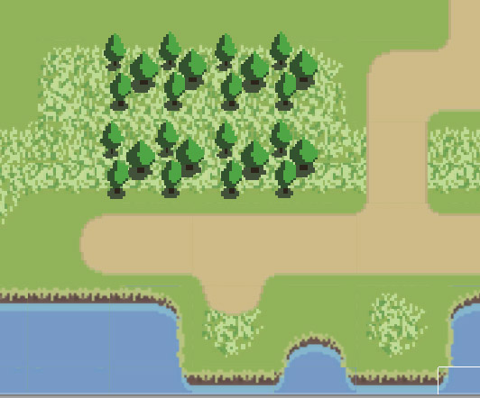
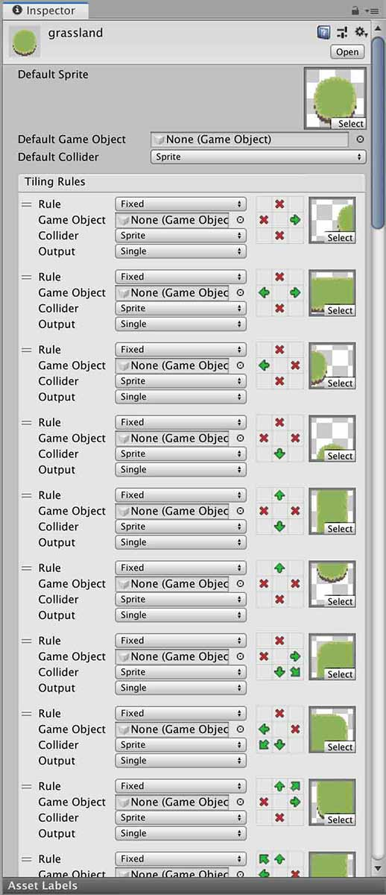
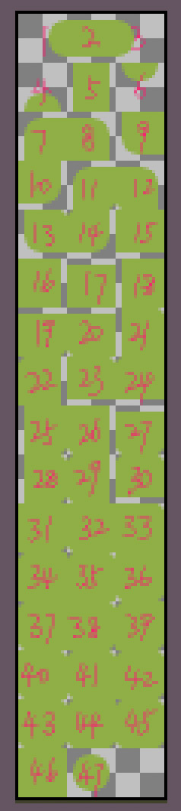
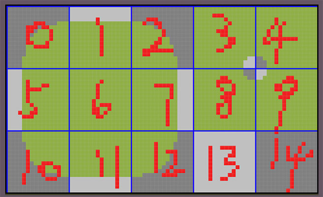
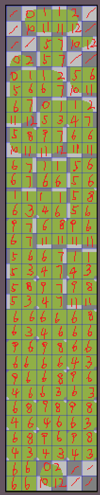

TiledMap中的RuleTile是非常好用的2d刷地形工具,当你设置好各种相邻条件的图块后,刷地形时它会根据相邻的情况使用对应的图块,这样会更加方便.

<!-- more -->



## RuleTile  
我自己因为需要制作地图,采用了这个方式,但是绘制时遇到了一个问题,那就是条件实在太多了,有47种情况,这要画起来那得多让人崩溃.





不过可以发现,很多图块都有很多部位是重复的,将这些重复区域提取出来,会发现是由这样一个基础图块组成的



这是粒度更小的基础图块,每4个可以组合成一个大图块,只要绘制这样一个基础图块,我们就可以生成那47个大图块



## 使用Python编写  

有了这样一个元图块集和映射关系,就不需要手动去拼接,这时候使用python去编写一个拼接工具

#### Image类  

##### `paste(from_box, cur_box)`粘贴方法
接受两个参数
`from_box`表示从基础图片中置顶区域的切图
`cur_box`表示粘贴到自身图片的目标区域

##### `crop(box)`切图方法  
`box`表示切图区域

这样就可以通过:
```python
srcImage = Image.open(...) # 打开基础图片
newImage = Image.new(...) # 新建输出的图片
src_box = (0, 0, 16, 16) # 基础图块的位置
dest_box = (...) # 欲粘贴的位置
# 实现从一张图上切出区域粘贴到另一张图上的指定区域
newImage.paste(srcImage.crop(src_box), dest_box)
```

---
完整代码

```python
from PIL import Image
import os
import sys

# 获取当前目录
cur_dir = os.path.dirname(__file__)
# 元数据文件目录
src_dir = cur_dir + "/../"
# 导出目录
export_dir = cur_dir + "/export/"
# 图块像素大小
pixel_size = 16
# 图块缩放比例
size_scale = 4
# 元数据列数
src_row = 5
# 元数据行数
src_column = 3
# 导出图片列数
dest_row = 6
# 导出图片行数
dest_column = 32
# 导出图片映射表
dest_maps = [
	-1, 0, 1, 1, 2, -1,
	-1, 10, 11, 11, 12, -1,
	-1, -1, 5, 7, 10, 12,
	0, 2, 5, 7, -1, -1,
	0, 1, 1, 2, 5, 6,
	5, 6, 6, 7, 10, 11,
	6, 7, 0, 1, 1, 2,
	11, 12, 5, 3, 4, 7,
	5, 8, 9, 7, 6, 6,
	10, 11, 11, 12, 11, 11,
	6, 7, 1, 1, 5, 6,
	6, 7, 6, 6, 5, 6,
	1, 1, 1, 1, 5, 8,
	6, 3, 4, 6, 5, 6,
	9, 7, 6, 8, 9, 6,
	6, 7, 11, 11, 11, 11,
	5, 6, 6, 7, 1, 1,
	5, 3, 4, 7, 4, 3,
	5, 8, 9, 7, 9, 8,
	5, 3, 4, 7, 11, 11,
	6, 6, 6, 6, 6, 8,
	6, 3, 4, 6, 6, 6,
	9, 6, 9, 8, 6, 6,
	6, 6, 6, 6, 4, 3,
	9, 6, 6, 8, 9, 6,
	4, 6, 6, 3, 6, 3,
	6, 8, 9, 8, 9, 8,
	4, 6, 4, 6, 6, 3,
	6, 8, 9, 6, 9, 8,
	4, 3, 4, 3, 4, 3,
	6, 6, 0, 2, -1, -1,
	6, 6, 10, 12, -1, -1
]

# 计算出size的大小
grid_size = pixel_size * size_scale

# 用于获取扩展名的方法
def extname(filename):
	ret = os.path.splitext(filename)
	if len(ret) >= 2:
		return ret[1]
	return ""

# 查找当前目录
def find_str_from_list(li, str):
	for i in range(len(li)):
		if li[i] == "%s" % (str):
			return i
	return -1

# 获取指定目录,指定扩展名的所有文件
def get_all_files(path, filters: list):
	files: list = []
	temp_list = os.listdir(path)
	for check in temp_list:
		check_path = os.path.join(path, check)
		if os.path.isdir(check_path):
			deep_files = get_all_files(check_path, filters)
			for deep_file in deep_files:
				files.append(deep_file)
		else:
			ext = extname(check_path)
			find_index = find_str_from_list(filters, ext)
			if find_index >= 0:
				files.append(check_path)
	return files

# 删除目录
def remove_dir(path):
	temp_list = os.listdir(path)
	for check in temp_list:
		check_path = os.path.join(path, check)
		if os.path.isdir(check_path):
			remove_dir(check_path)
			os.rmdir(check_path)
		else:
			os.remove(check_path)

# 创建目录
def mk_dir(path):
	if os.path.isfile(path):
		return
	if not os.path.exists(path):
		mk_dir(os.path.dirname(path))
		os.mkdir(path)

# 从基础图集生成最终的图块图集
def convert_to_altas(filename):
	if not os.path.exists(filename):
		return ""
	src_img = Image.open(filename)
	dest_img = Image.new(
		"RGBA", (dest_row * grid_size, dest_column * grid_size))
	for i in range(len(dest_maps)):
		sign = dest_maps[i]
		if sign == -1:
			continue
		src_y = int(sign / src_row)
		src_x = int(sign % src_row)
		src_box = (src_x * grid_size, src_y * grid_size,
				   (src_x + 1) * grid_size, (src_y + 1) * grid_size)

		dest_y = int(i / dest_row)
		dest_x = int(i % dest_row)
		dest_box = (dest_x * grid_size, dest_y * grid_size,
					(dest_x + 1) * grid_size, (dest_y + 1) * grid_size)
		dest_img.paste(src_img.crop(src_box), dest_box)

	dest_filename = export_dir + filename.replace(src_dir, "")
	mk_dir(os.path.dirname(dest_filename))
	dest_img.save(dest_filename)
	return dest_filename

remove_dir(cur_dir + "/export")

# 将src_dir目录下的所有png后缀的基础图集转换成图块图集并放到export目录下
files = get_all_files(src_dir, [".png"])
for filename in files:
	tempdir = os.path.dirname(filename)
	dest = convert_to_altas(filename)
	print("> " + dest)

print("finished.")
```

