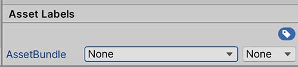
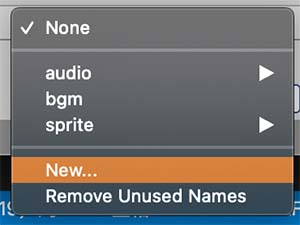
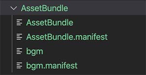

总结一下Unity中的打包.

- 打包
- 使用
- 扩展

<!-- more -->

## 打包  
首先打包AssetBundle需要选择要打包的内容,然后使用打包方法打包.

**第一步 选定打包的内容**   
在资源目录内,选中要打包的文件夹或者文件,选择文件夹时,会包含文件夹内的所有内容,选中后,可以看到`Inspector`最下方有一个`Asset Labels`选项,点击后会出现`AssetBundle`选项,有两个下拉列表,前者选择包的文件名,后者选择后缀名

  

已经设置过的名称会出现在列表中,如果需要新建则选择`New...`选项,手动输入名称  



名称支持目录形式,使用`/`方式分割,例如`audio/sound`表示将`sound`包放在`audio`文件夹下

注意:一个AssetBundle包内的资源文件名不能相同,即使在不同路径下

**第二步 打包方法调用**  

上一步配置好之后,此时需要调用打包的方法才会生效,打包方法在`UnityEditor`的命名空间内,所以这个方法在编辑器环境下使用,打包的方法是`BuildPipeline.BuildAssetBundles()`,此方法有3个参数,分别为`导出路径,导出选项,目标平台`,参数2一般设置为`None`,参数3根据发布的平台设置

```csharp
BuildPipeline.BuildAssetBundles("AssetBundle", BuildAssetBundleOptions.None, BuildTarget.StandaloneOSX);
```

Unity支持对编辑器开发扩展应用,将这个方法放到菜单中,以便之后方便调用,在`Assets`目录下的`Editor`文件夹内新建`EditorBuildAssetBundle.cs`,代码如下:

```csharp
using UnityEditor;
using System.IO;

public class EditorBuildAssetBundle
{
	// 在Assets菜单下新建Build AssetBundle菜单
    [MenuItem("Assets/Build AssetBundle")]
    static void BuildAssets()
    {
        string dir = "AssetBundle";
        if (!Directory.Exists(dir))
        {
            Directory.CreateDirectory(dir);
        }
		// 根据需要可以增加多个菜单选项来适应需求
        BuildPipeline.BuildAssetBundles(dir, BuildAssetBundleOptions.None, BuildTarget.StandaloneOSX);
    }
}
```

通过菜单`Assets->Build AssetBundle`,调用之后就会根据之前的配置将打包后的文件导出在`项目/AssetBundle/`下了,比如我设置的`bgm`资源



关于参数2:

```csharp
using System;

public enum BuildAssetBundleOptions
{
	None = 0x0, // 不使用任何特殊选项
	UncompressedAssetBundle = 0x1, // 不压缩
	CollectDependencies = 0x2, // 包含所有依赖关系
	CompleteAssets = 0x4, // 强制包括整个资源
	DisableWriteTypeTree = 0x8, // 不包含类型信息
	DeterministicAssetBundle = 0x10, // 使用hash id构建
	ForceRebuildAssetBundle = 0x20, // 强制重新构建
	IgnoreTypeTreeChanges = 0x40, // 忽略TypeTree的变化
	AppendHashToAssetBundleName = 0x80, // 将hash附加到资源名称上
	ChunkBasedCompression = 0x100, // 使用lz4的格式压缩
	StrictMode = 0x200, // 使用严格模式构建
	DryRunBuild = 0x400, // 不实际构建资源
	DisableLoadAssetByFileName = 0x1000, // 不使用资源名称加载
	DisableLoadAssetByFileNameWithExtension = 0x2000, // 不使用带后缀的文件名加载
	AssetBundleStripUnityVersion = 0x8000 // 构建期间删除Unity版本号
}

```
以上参数的具体详细解释请参照Unity官网API的[BuildAssetBundleOptions页面](https://docs.unity3d.com/ScriptReference/BuildAssetBundleOptions.html)说明


## 使用  

使用`AssetBundle`类来加载和获取资源

**使用Load系列方法加载资源**
```csharp
// 通过文件名路径加载
AssetBundle.LoadFromFile();
// 通过数据流加载
AssetBundle.LoadFromStream();
// 通过内存数据加载
AssetBundle.LoadFromMemory();
```
因为资源包会根据不同的需求放在不同的位置,这里的`AssetBundle`文件夹位于项目根目录下,并且在Unity编辑器环境下可以直接通过文件相对路径加载,故通过以下方法加载:

```csharp
var assetBundle = AssetBundle.LoadFromFile("AssetBundle/bgm");
```

对于获取到的`assetBundle`对象,里面包含了打包进去的文件,通过如下方法获取:

```csharp
var bgmClip = assetBundle.LoadAsset<AudioClip>("bgm");
```

注意:
不论之前资源在什么目录下的,这里获取资源都只使用文件名获取,这也是为什么之前打包时不能有相同文件名的原因

## 扩展  
AssetBundle在使用时会面临一些问题

**开发环境和最终发布区分**  
开发时,在得到资源后,每次都要打包一下再使用,确实是不利于效率的,很多资源都是需要频繁修改的,所以一般是在最终发布时打包,那么就需要一个管理类来负责这个事情,拿到的资源直接放在指定的目录下,通过对`Application.platform`的判断来决定使用何种方式读取资源.

**依赖关系**  
比如有a,b两个包,b中的某个资源依赖于a包中的某个资源,如果使用资源时,只加载b而没有加载a的情况下,b中这个资源则会出问题,需要确保a包也加载,解决这种问题,需要从两个方面下手,一方面是项目资源结构上,需要做到良好区分功能,我的观点是通过功能划分资源,这样一个包则包含这个功能的所有文件,就不需要去加载其他包中的内容了. 另一方面是根据资源的通用程度,划分出通用资源,保持一直存在. 复杂的情况下可以写一个资源层级目录,根据目录,在管理器中判断是否已经加载,没有则层层往上,直到依赖项全部加载为止.

**最后**  
那么本文就结束了,以上想法都是我的心得和浅见,希望能够帮助到大家.

