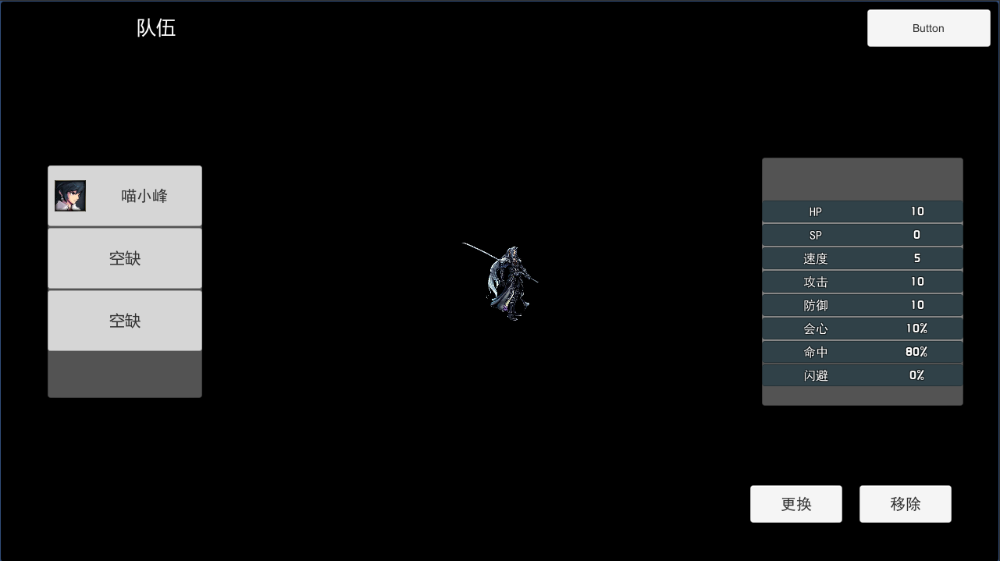
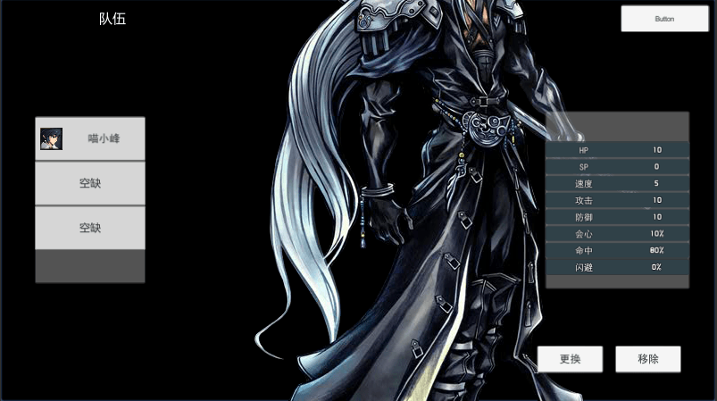
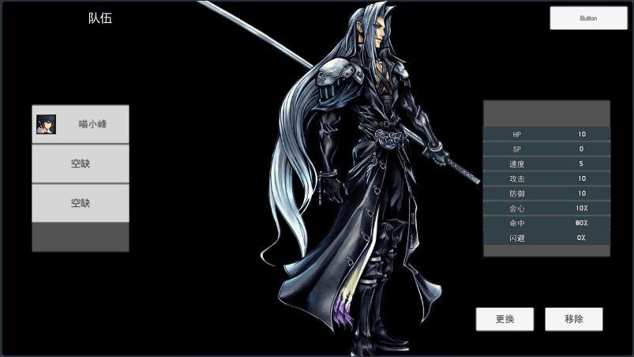

很多情况下没办法事先在编辑器中确定需要展示的Image,需要动态去创建,例如根据角色ID显示角色的立绘,本文讲一讲动态创建时需要注意的两个问题:
- 保持宽高比
- 分辨率适配

<!-- more -->

## 关键代码
`image.SetNativeSize();` 设置为图片原本的大小
`image.rectTransform.sizeDelta *= image.canvas.scaleFactor;` 设置为当前分辨率适配

## 动态创建Image

```csharp
var sprite = Resources.Load<Sprite>(path);
if (sprite) {
    var image = new GameObject("image").AddComponent<Image>();
    image.rectTransform.SetParent(_parentTransform);
    image.sprite = sprite;
}
```
这样就动态创建了一个显示`path`路径资源的Image图片,并且放在`_parentTransform`对象下,但是这样创建出来的图像,宽高不正确并且被伸缩了,因此需要保持正确的宽高比



## 保持宽高比

```csharp
image.SetNativeSize();
image.rectTransform.sizeDelta *= _scale;
```
`image.SetNativeSize();` 设置为图片原始的大小
`image.rectTransform.sizeDelta` 是图片当前显示的大小
`_scale` 是缩放比例,可以是一个确定值,当要改变图片大小时,通过这个方式,始终保持图片的宽高比

但是现在这样创建的图片,有一个问题,在运行时改变分辨率的话,只会对当前已创建的`Image`适配分辨率,重新创建的`Image`显示的大小仍然是原始大小,这里就需要手动适配

下面是分辨率从`1280x720`改到`800x450`后的结果:


## 分辨率适配

```csharp
image.rectTransform.sizeDelta *= image.canvas.scaleFactor;
```
在创建时加上这行代码,就OK了

`image.canvas.scaleFactor` 获取当前分辨率的缩放比



## 完整代码

```csharp
var sprite = Resources.Load<Sprite>(path);
if (sprite) {
    var image = new GameObject("image").AddComponent<Image>();
    image.rectTransform.SetParent(_parentTransform);
    image.sprite = sprite;
    image.SetNativeSize();
    image.rectTransform.sizeDelta *= image.canvas.scaleFactor;
}
```
