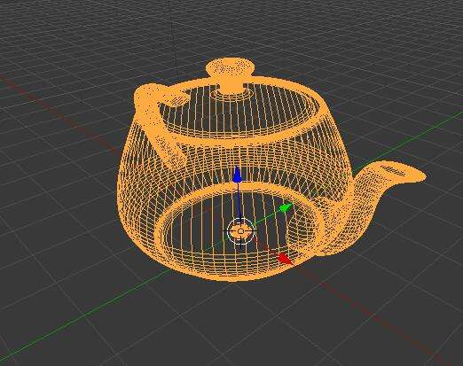
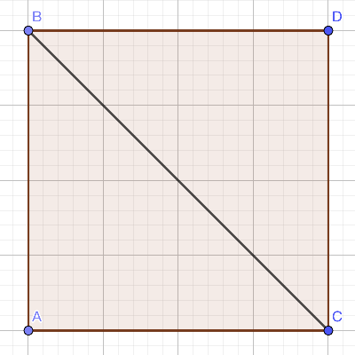

Mesh是计算机模型的网格结构，由点线面组成的形状来表现的，在建模的过程中就是在操作这些点线面的坐标和大小等信息来做出想要的模型形状

<!-- more -->

  

## Unity Mesh属性和用法
### 属性  
三角形是构成面的最小图形，所以Mesh是由一个个三角形组成的网格  
**顶点集合 vertices：** 组成几何图形的点的坐标的集合  
**三角形集合 trangles：** 组成三角形的顶点序号集合  
**法线集合 normals：** 每个顶点的法线  
**纹理坐标 uv** 顶点和纹理贴图的位置关系  

### 用法  
  
如图的四边形，四个点的坐标分别为：
A(0, 0, 0)
B(0, 1, 0)
C(1, 0, 0)
D(1, 1, 0)

在Mesh中，ABCD四个点为顶点，按照三角形为单位绘制，四边形是由两个三角形组成，绘制时按顺时针的顺序，即T1(ABC),T2(CBD)

所以代码中：
```csharp
// 顶点坐标
vertices[0] = new Vector3(0, 0, 0); // A
vertices[1] = new Vector3(0, 1, 0); // B
vertices[2] = new Vector3(1, 0, 0); // C
vertices[3] = new Vector3(1, 1, 0); // D
// 三角形绘制顺序
triangles = {
	0, 1, 2, // ABC
	2, 1, 3  // CBD
}
// 赋值  
mesh.vertices = vertices;
mesh.triangles = triangles;
// 更新法线
mesh.RecalculateNormals();
```

在Unity中，自定义Mesh通过组件`MeshFilter`来设置数据，通过`MeshRenderer`来绘制图形  
