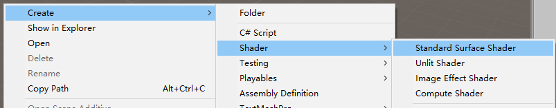
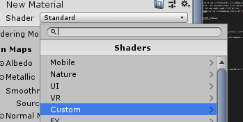
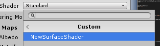

对Shader是又喜欢又苦恼,几年来,一直断断续续的接触又放弃,因为对于Shader,要学的东西太多太多了,它不像写逻辑,再复杂的功能也能一点点攻克,它是真的让我感觉到脑袋不够用了,是硬伤.但是,掌握Shader很有必要,所以我又双叒叕来看Shader了,而这次,得利于Unity的表面着色器,让Shader入门简单了一些,嗯,看了一周,做点笔记.

本文:
- Shader
- UnityShader
- UnitySurfaceShader
- 一个改变颜色的小例子

<!-- more -->

## Shader

简单来说`Shader`就是一段程序,可以操作`顶点`和`像素`.我们知道计算机中图形是由三角形组成的,一个三角形有三个点,`顶点`指的就是这三个点,而`像素`不用多说,都懂,`Shader`就是可以操作这些东西的`位置`和`颜色`,从而实现很多效果.

目前有三大Shader语言
`GLSL`是OpenGL支持的Shader语言
`HLSL`是微软DirectX支持的Shader语言,而DX只支持Windows设备,所以不具备跨平台性
`CG`是微软和Nvidia合作开发的Shader语言,它支持跨平台,非常类似`HLSL`

## UnityShader

Unity中的`ShaderLab`主要基于`CG`语言.

Unity中的Shader分为三类:
`固定功能着色器`对应旧式的固定渲染管线,这里不考虑了,基本上用不到
`顶点/片元着色器`就是通常的Shader
`表面着色器`是Unity中特有的,可以理解为是对`顶点/片元着色器`的再一次抽象,Unity最终会将其编译为`顶点/片元着色器`代码,它简单一些,也更适合作为入门来学习Shader

## UnitySurfaceShader

我还是比较推荐从`表面着色器`开始学习的,一方面简单一些,另一方面可以更快的写出一些不错的效果,并且使用在自己的项目上.我也正是在学习这个,当然,最终目标还是要掌握`顶点/片元着色器`的.

下面就开始详细讲解`表面着色器`了:

**新建一个表面着色器代码文件**

在Unity的Project视窗下新建一个Shader文件.



打开文件,可以看到Unity生成的一堆模板代码,有一堆,莫慌,下面就来拆解它.

### Shader结构

忽略中间的代码,关注到第一行的结构,如下:

```CG
Shader "Custom/NewSurfaceShader" {
    ...
}
```

在UnityShader中,所有的Shader代码都被包括在这里面,跟在`Shader`关键词后面双引号中的内容表示这个Shader在Unity视窗里选择Shader时的路径,如下:




- **Properties**

```CG
Properties {
    ...
}
```

`Properties`中用来定义一些输入属性,即一些参数,这些参数可以在后面的代码中使用,作为外部调节具体细节的变量,如果没有变量,也可以不写,内部属性的定义后面再说

- **SubShader**

```CG
SubShader {
    ...
}
```

`SubShader`就是具体实现效果的部分,可以有多个`SubShader`,当存在多个时,会按顺序从上到下检测条件,直到找到一个符合条件可以执行的SubShader然后执行

- **FallBack**
```CG
FallBack "Diffuse"
```

如果所有的SubShader都不满足条件执行,那么会执行后面的`FallBack`中指定的内置Shader, 这里的`"Diffuse"`表示一个内置Shader的名称,Diffuse即漫反射

### SubShader结构

- **Tags**
```CG
Tags {
    "RenderType"="Opaque"
    /*
    "Name1"="Value1"
    "Name2"="Value2"
    ...
    */
}
```
此项可以不写,`Tags`就相当于一个标签,给这个SubShader指定的标签,这个暂时不关心,忽略就好

*对于`"RenderType"="Opaque"`的含义,可以简单理解为不透明的渲染方式,但实际上这个生效的意义需要配合额外的代码控制*


- **LOD**
此项可以不写,`LOD`用来表示这个SubShader的细节层次,这里使用默认的200就好,或者可以不写,暂不关心.

*实际上这个值也要配合额外的代码才会生效,例如`Shader.globalMaximumLOD = 100;`,则表示设置当前全局Shader的`LOD小于等于100`的才会被执行,这个值若不设置默认为`int.MaxValue`*

- **CGPROGRAM 和 ENDCG**

重点部分来了,`CGPROGRAM`和`ENDCG`是一组关键词,就像C#中的`#region`和`#endregion`一样,被包括的部分正是我们需要实现各种效果的CG代码

```CG
CGPROGRAM
    ...
ENDCG
```

对于这里的内容,后面结合一个小例子来讲.

到这里,整个Unity的Shader结构就搞清楚了,下面贴一个结构部分的整体代码:
```CG
Shader "Custom/ShaderDemo1" {
    Properties {
    }
    SubShader {
        // Tags { }
        // LOD 200
        CGPROGRAM
        ENDCG
    }
    FallBack "Diffuse"
}
```

### 一个改变颜色的小例子

到这里,已经迫不及待想要自己写一个试试了,那么开始吧.我们自己新建一个空白文本来写Shader,这样利于学习,思路清晰.下面就一步一步来写一个最最最基础的改变颜色的着色器,以此来开启大门

完整代码,下面将在注释上讲解:
```CG
Shader "Custom/ShaderDemo1" {
    Properties {
        /**
        这里是定义了一个属性,它的定义方式是 `变量名("说明", 类型) = 默认值`
        这里表示定义了一个Color类型的变量_Color, 默认RGBA是(1, 1, 1, 1)
        */
        _Color ("Color", Color) = (1, 1, 1, 1)
    }
    SubShader {
    // =============================================================
        CGPROGRAM
        /**
        这是一个预编译命令,用于指明这是一个`表面着色器`
        `surface`表示这是一个`表面着色器`
        `surf`用于声明调用的函数
        `Lambert`表示采用内置默认的Lambert光照模型,详情可以自行搜索`Lambert光照模型`
        */
        #pragma surface surf Lambert

        /**
        这是一个结构体,上面声明的`surf`函数需要一个输入的参数正是这个结构体,里面的成员变量是可变的
        `float2`表示两个float组成的结构体,可以通过下标访问,也可以通过`.x`,`.y`,`.z`或者`.r`,`.g`,`.b`这种形式来访问
        `uv_MainTex`这个成员变量表示纹理坐标,`uv`作为打头是必须的,表示它是一个纹理坐标
        这个结构体在这个例子中并没有用到,我们只要定义它就好了,可以暂时不关心
        */
        struct Input {
            float2 uv_MainTex;
        };
        
        /**
        这里需要再定义一下这个变量,变量名与上面`Properties`中一样,这样就会获得到属性中设置的值
        这里是必须再定义一下的,否则是获取不到上面`Properties`中的值的
        */
        fixed4 _Color;

        /**
        这个正是上面我们指定的函数`surf`
        参数1:是输入的数据,它会将当前使用这个Shader的物体上的纹理坐标传入过来
        参数2:`SurfaceOutput`是一个输出的数据结构,是Unity内置的,描述了最终显示需要的颜色和数据
        所以,我们根据`Input`数据,计算出想要的结果给`SurfaceOutput`
        */
        void surf(Input IN, inout SurfaceOutput o) {
            /**
            Albedo是`SurfaceOutput`中的成员变量,表示反射的颜色,这里简单理解为物体的颜色
            `_Color.rgb`表示将`rgb`的值作为最终显示的颜色,`Albedo`不包含透明
            */
            o.Albedo = _Color.rgb;
            // Alpha 表示透明值
            o.Alpha = _Color.a;
        }
        ENDCG
    // =============================================================
    }
    FallBack "Diffuse"
}
```

到这里,一个Shader就写完了,Shader需要结合材质一起才能看到效果,在Unity中创建一个`Cube`,然后在Project下新建一个`Material`材质文件,将`Shader`拖到`Material`上,将`Material`拖到`Cube`上,就可以看到效果了,会有一个颜色选择框,可以调节颜色.

Shader的路还很长,耐心并坚持,加油.

---

下一篇:[Unity表面着色器笔记(二)](https://jenocn.github.io/2019/08/UnitySurfaceShader2/)

