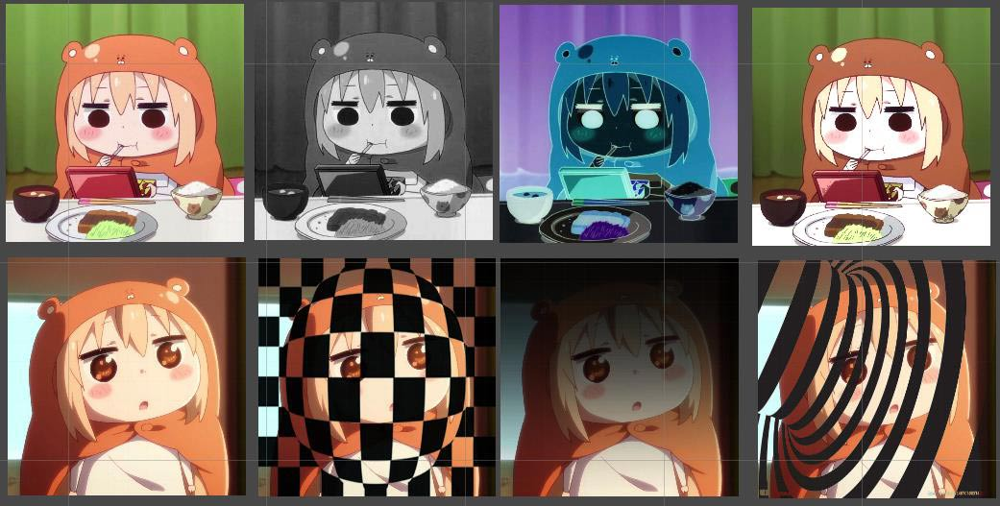
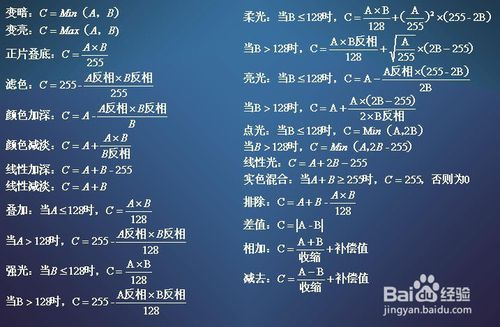

这篇要讲的是纹理贴图以及纹理混合,掌握纹理混合就可以做很多2D游戏的特效啦,激动啊!

- 纹理贴图
- 颜色效果
- 纹理混合

<!-- more -->

---

上一篇:[Unity表面着色器笔记(二)](https://jenocn.github.io/2019/08/UnitySurfaceShader2/)

---

效果展示:
(原图, 置灰, 反转, 增加亮部减暗暗部)
(各种纹理混合)


## 纹理贴图  

翻到上一篇,Properties属性中有一个`2D`类型,它表示一张纹理的信息,所以我们需要在属性中定义它,用于获取外部纹理

*代码直接在第一篇中写的小练习上直接改*

```CG
Properties {
    _MainTex ("Main Texture", 2D) = "white" {}
}
```

然后想在CGPROGRAM中使用它,需要再声明一次

```CG
CGPROGRAM
sampler2D _MainTex;
ENDCG
```

定义Input结构体
```CG
struct Input {
    // 纹理坐标
    float2 uv_MainTex;
};
```

##### 然后在surf函数中调用纹理,并输出颜色,这里引入一个方法`tex2D`

参数接收纹理和采样坐标,返回纹理在采样坐标位置的颜色值
`fixed4 tex2D(sampler2D texture, float2 pos);`

```CG
void surf(Input IN, inout SurfaceOutput o) {
    fixed4 c = tex2D(_MainTex, IN.uv_MainTex);
    // 忽略光照影响,直接赋值给自发光
    o.Emission = c.rgb;
}
```

这样就完成贴图了,在Unity中查看吧,需要将纹理拖放到材质上,就可以看到图片显示了

完整代码:
```CG
Shader "Custom/ShaderDemo1" {
    Properties {
        _MainTex ("Main Texture", 2D) = "white" {}
    }
    SubShader {
        CGPROGRAM

        #pragma surface surf Lambert

        sampler2D _MainTex;

        struct Input {
            float2 uv_MainTex;
        };

        void surf(Input IN, inout SurfaceOutput o) {
            fixed4 c = tex2D(_MainTex, IN.uv_MainTex);
            o.Emission = c.rgb;
            o.Alpha = c.a;
        }
        ENDCG
    }
    FallBack "Diffuse"
}
```

## 颜色混合  

只需要对上面tex2D输出的颜色做一点小小的修改,就可以实现各种效果,这里列举两个,置灰和反转色,其他的可以自己修改各种值来试试

#### 置灰  
置灰有很多种计算方式,本质上一张灰度图其实就是没有色彩,只有明暗,所以RGB三个值都是相同的,我这里采用RGB取最小值的方式实现,这也是比较简单的方法,不用去对颜色做RGB转HSL的来回转换了

```CG
void surf(Input IN, inout SurfaceOutput o) {
    fixed4 c = tex2D(_MainTex, IN.uv_MainTex);

    // 将c.rgb赋值为最小值, min方法用于获取最小值
    c.rgb = min(c.r, min(c.g, c.b));

    o.Emission = c.rgb;
    o.Alpha = c.a;
}
```

#### 反转色  
反转色就是取互补值得颜色嘛,用最大值减去当前颜色就行了

```CG
void surf(Input IN, inout SurfaceOutput o) {
    fixed4 c = tex2D(_MainTex, IN.uv_MainTex);

    // 最大值白色值为1
    c.rgb = 1 - c.rgb;

    o.Emission = c.rgb;
    o.Alpha = c.a;
}
```


## 纹理混合  

纹理混合就是同时显示两张纹理,原理是将两张纹理对应坐标的颜色采用一个计算方式混合生成新的颜色,纹理的混合有很多种方式,像常见的有正片叠底,这里就使用正片叠底来作为例子,其他的混合方式可以网上搜索,后面我会给出一个公式参考图.

在Properties中增加一个纹理属性
```CG
Properties {
    _MainTex ("Main Texture", 2D) = "white" {}
    // 新增一个用于混合的纹理属性
    _MixTex ("Mix Texture", 2D) = "white" {}
}
```

在surf函数中使用,别忘了声明这个变量.

```CG
void surf(Input IN, inout SurfaceOutput o) {
    // 贴图
    fixed4 c_main = tex2D(_MainTex, IN.uv_MainTex);
    // 获取混合纹理的采样颜色
    fixed4 c_mix = tex2D(_MixTex, IN.uv_MainTex);
    // 两个颜色相乘
    fixed4 c = c_main * c_mix;

    o.Emission = c.rgb;
    o.Alpha = c.a;
}
```

然后找一张用于混合的纹理,查看效果吧.

---

供参考的公式:



来源: <a href="https://jingyan.baidu.com/article/36d6ed1f7c04801bcf4883c2.html">https://jingyan.baidu.com/article/36d6ed1f7c04801bcf4883c2.html</a>

---

下一篇:[Unity表面着色器笔记(四)](https://jenocn.github.io/2019/09/UnitySurfaceShader4/)

