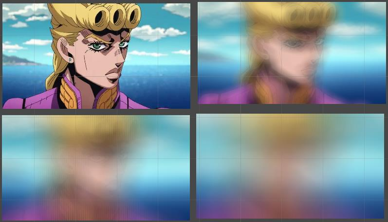
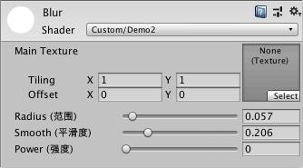

毛玻璃效果很漂亮,所以来实现一下吧!!

<!-- more -->

---

上一篇:[Unity表面着色器笔记(三)](https://jenocn.github.io/2019/08/UnitySurfaceShader3/)

---

效果展示:
  


## 原理  
毛玻璃效是一种模糊效果,实现思路应该有很多吧,这里采用最简单的一种方式,以像素为圆心,取周围半径范围内颜色的平均值,即可得到

## 实现  
首先封装一个方法来实现模糊效果  
```csharp
/**
参数:
  tex:纹理
  uv:纹理取值坐标
  value:范围值(半径范围)
  step:取值步数(光滑度)
  percent:模糊占比(强度)
返回值:
  最终颜色
*/
half4 GetBlurColor(sampler2D tex, float2 uv, half value, half step, half percent) {
  // 首先限定每个值得范围,使其具有意义,并不会出错
  value = clamp(value, 0.001, 1);
  step = floor(clamp(step, 2, 100));
  percent = clamp(percent, 0, 1);

  // 最终返回值,最终取平均值
  half4 ret = 0;
  // 求出每一步的具体长度
  half delta = value * 2 / step;
  // 用于统计有效迭代次数
  half count = 0;
  // 用于判断是否在圆内的一个比较值,提前算好,也是为了减少计算量
  half compareValue = value * value;

  // 遍历纹理在value范围下的坐标[-value ~ value]
  for (half i = -value; i < value; i += delta) {
    for (half j = -value; j < value; j += delta) {
      // 如果在圆外则不参与取值
      if (i * i + j * j > compareValue) { continue; }
      // 得到当前位置的坐标
      float2 tempUV = uv + float2(i, j);
      // 取当前位置的颜色
      fixed4 c = tex2D(tex, tempUV);
      // 求和
      ret += c;
      count += 1;
    }
  }
  // 取出平均值 * 占比 + 原本颜色 * (1 - 占比)
  return ret / count * percent + tex2D(tex, uv) * (1 - percent);
}
```

属性中声明一些外部可以控制的变量,用于调节实际效果
```csharp
Properties {
  _MainTex ("Main Texture", 2D) = "white" {}
  _Radius ("Radius (范围)", Range(0, 1)) = 0.2
  _Smooth ("Smooth (平滑度)", Range(0, 1)) = 0.5
  _Power ("Power (强度)", Range(0, 1)) = 1
}
```

  

surf函数中
```csharp
void surf(Input IN, inout SurfaceOutputStandard o) {
  // 将Properties中的属性转换为GetBlurColor需要的参数
  // 这里做转换而不是直接在Properties中设置对应的值,是为了属性的可读性
  half4 c = GetBlurColor(_MainTex, IN.uv_MainTex, _Radius, _Smooth * 100, 0.9 + _Power * 0.1);
  o.Emission = c.rgb;
  o.Alpha = c.a;
}
```

## 完整代码  
```csharp
Shader "Custom/Blur" {
  Properties {
    _MainTex ("Main Texture", 2D) = "white" {}
    _Radius ("Radius (范围)", Range(0, 1)) = 0.2
    _Smooth ("Smooth (平滑度)", Range(0, 1)) = 0.5
    _Power ("Power (强度)", Range(0, 1)) = 1
  }
  SubShader {
    CGPROGRAM

    #pragma surface surf Standard fullforwardshadows alpha
    #pragma target 3.0

    struct Input {
      float2 uv_MainTex;
    };

    sampler2D _MainTex;
    half _Radius;
    half _Smooth;
    half _Power;

    half4 GetBlurColor(sampler2D tex, float2 uv, half value, half step, half percent) {
      value = clamp(value, 0.001, 1);
      step = floor(clamp(step, 2, 100));
      percent = clamp(percent, 0, 1);

      half4 ret = 0;
      half delta = value * 2 / step;
      half count = 0;
      half compareValue = value * value;

      for (half i = -value; i < value; i += delta) {
        for (half j = -value; j < value; j += delta) {
          if (i * i + j * j > compareValue) { continue; }
          float2 tempUV = uv + float2(i, j);
          fixed4 c = tex2D(tex, tempUV);
          ret += c;
          count += 1;
        }
      }
      return ret / count * percent + tex2D(tex, uv) * (1 - percent);
    }

    void surf(Input IN, inout SurfaceOutputStandard o) {
      half4 c = GetBlurColor(_MainTex, IN.uv_MainTex, _Radius, _Smooth * 100, 0.9 + _Power * 0.1);
      o.Emission = c.rgb;
      o.Alpha = c.a;
    }

    ENDCG
  }
  Fallback "Diffuse"
}
```

---

下一篇:[Unity表面着色器笔记(五)](https://jenocn.github.io/2019/09/UnitySurfaceShader5/)

