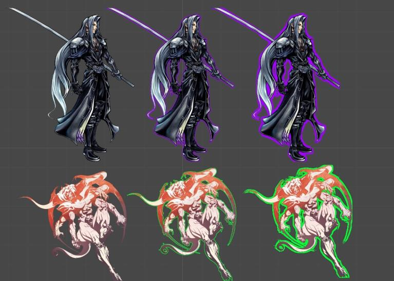
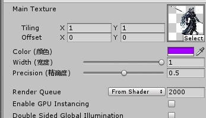

周末在家玩游戏,然后看到怪物霸体的描边效果,描边在游戏中是很常用的,所以想自己实现一个,思考了一下,想到一个非常简单的方法

<!-- more -->

---

上一篇:[Unity表面着色器笔记(四)](https://jenocn.github.io/2019/09/UnitySurfaceShader4/)

---

效果展示:




## 原理  
描边也有很多实现方法吧,我的办法是,检测一个透明像素的周围是否有非透明像素,如果有,则将当前透明像素填充为描边颜色

## 实现  
还是封装一个方法比较简洁
```csharp
/**
参数:
  tex:纹理
  uv:纹理取值坐标
  color:描边颜色
  width:描边宽度
  precision:精确度(透明度检测基准,小于该值则判定为可描边的区域)
返回值:
  最终颜色
*/
fixed4 GetOutlineColor(sampler2D tex, float2 uv, fixed4 color, fixed width, fixed precision) {
  // 首先获取原本的颜色,并判定是否是有效颜色
  // 有效颜色则表示非描边区域,直接返回该位置的颜色
  fixed4 origin = tex2D(tex, uv);
  if (origin.a > precision) {
    return origin;
  }
  // 描边区域检测
  // 中心点周围3x3的九宫格区域
  for (fixed i = 0; i < 3; ++i) {
    for (fixed j = 0; j < 3; ++j) {
      // 获取当前位置的实际纹理坐标
      // width位置的纹理
      float2 tempUV = uv + float2(i - 1, j - 1) * width;
      // 获取颜色,并判断颜色是否有效
      fixed4 c = tex2D(tex, tempUV);
      // 如果颜色有效,说明uv这个位置需要描边,返回描边的颜色color
      if (c.a > precision) {
        return color;
      }
    }
  }
  // 周围未找到有效颜色,返回原始颜色
  return origin;
}
```

将描边的颜色,宽度,精准度提取出来,供外部设置  
```csharp
Properties {
  _MainTex ("Main Texture", 2D) = "white" {}
  _Color ("Color (颜色)", Color) = (1, 1, 1, 1)
  _Width ("Width (宽度)", Range(0, 1)) = 0.5
  _Precision ("Precision (精确度)", Range(0, 0.99)) = 0.5
}
```



surf函数中
```csharp
void surf(Input IN, inout SurfaceOutputStandard o) {
  // 调用即可
  half4 c = GetOutlineColor(_MainTex, IN.uv_MainTex, _Color, _Width * 0.01, _Precision);
  o.Emission = c.rgb;
  o.Alpha = c.a;
}
```

## 完整代码  
```csharp
Shader "Custom/OutlineShader" {
  Properties {
    _MainTex ("Main Texture", 2D) = "white" {}
    _Color ("Color (颜色)", Color) = (1, 1, 1, 1)
    _Width ("Width (宽度)", Range(0, 1)) = 0.5
    _Precision ("Precision (精确度)", Range(0, 0.99)) = 0.5
  }
  SubShader {
    CGPROGRAM

    #pragma surface surf Lambert alpha
    #pragma target 3.0

    sampler2D _MainTex;
    fixed4 _Color;
    fixed _Width;
    fixed _Precision;

    struct Input {
      float2 uv_MainTex;
    };

    fixed4 GetOutlineColor(sampler2D tex, float2 uv, fixed4 color, fixed width, fixed precision) {

      fixed4 origin = tex2D(tex, uv);
      if (origin.a > precision) {
        return origin;
      }

      for (fixed i = 0; i < 3; ++i) {
        for (fixed j = 0; j < 3; ++j) {
          float2 tempUV = uv + float2(i - 1, j - 1) * width;
          fixed4 c = tex2D(tex, tempUV);
          if (c.a > precision) {
            return color;
          }
        }
      }

      return origin;
    }

    void surf(Input IN, inout SurfaceOutput o) {
      half4 c = GetOutlineColor(_MainTex, IN.uv_MainTex, _Color, _Width * 0.01, _Precision);
      o.Emission = c.rgb;
      o.Alpha = c.a;
    }

    ENDCG
  }
  Fallback "Diffuse"
}
```

---

下一篇:[Unity表面着色器笔记(六)](https://jenocn.github.io/2020/01/UnitySurfaceShader6/)
