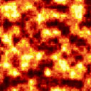

分享一下燃烧效果的shader实现思路,原理非常简单,掌握这个或许可以举一反三实现很多类似的效果哦

<!-- more -->

---

上一篇:[Unity表面着色器笔记(五)](https://jenocn.github.io/2019/09/UnitySurfaceShader5/)

---

效果展示:


## 原理

实现这个效果需要一张用于混合的燃烧纹理图片,例如:


在燃烧过程中,由于温度是不平均的,所以温度最高的地方先燃烧,然后逐渐向边缘燃烧
基于以上条件,在shader中根据红色程度来透明我们的目标图片,并在过渡边缘逐渐混合燃烧纹理,达到拟真的情况

设一个值Percent用于表示当前的燃烧程度,该值的范围从0~1,值越大,燃烧的越多,将这个值与rgb中的r做对比,Percent超出了r的值则将对应的像素透明化,然后还没超的r值根据一定的比例混合燃烧纹理,已达到边缘渐变效果

## 实现

定义需要的属性
```csharp
Properties
{
    // 想要作为燃烧目标的纹理
    _MainTex ("Albedo (RGB)", 2D) = "white" {}
    // 用于混合的燃烧纹理
    _CrossTex ("Cross Texture", 2D) = "white" {}
    // 燃烧程度
    _Percent ("Percent (比例)", Range(0, 1)) = 0.5
}
```

关键部分surf函数的实现
```csharp
void surf (Input IN, inout SurfaceOutput o)
{
    // 获取目标纹理和燃烧纹理当前坐标的颜色
    fixed4 c = tex2D (_MainTex, IN.uv_MainTex);
    fixed4 t = tex2D(_CrossTex, IN.uv_MainTex);

    // 判断当前燃烧程度是否超过红色值
    if (t.r <= _Percent) {
        // 超过了则将alpha值设为0
        c.a = 0;
    } else if (t.r <= _Percent * 2) {
        // 如果2倍的当前程度超过了红色值,则将纹理与燃烧纹理混合
        c.rgb *= t.rgb;
        // 透明度也做一个微弱的渐变,使得效果好一些
        c.a *= 1 - _Percent * 0.8;
    }

    o.Emission = c.rgb;
    o.Alpha = c.a;
}
```

## 完整代码

```csharp
Shader "Custom/noise_burn"
{
    Properties
    {
        _MainTex ("Albedo (RGB)", 2D) = "white" {}
        _CrossTex ("Cross Texture", 2D) = "white" {}
        _Percent ("Percent (比例)", Range(0, 1)) = 0.5
    }
    SubShader
    {
        Tags { "RenderType"="Transparent" }
        LOD 200

        CGPROGRAM
        // Physically based Standard lighting model, and enable shadows on all light types
        #pragma surface surf Lambert alpha

        // Use shader model 3.0 target, to get nicer looking lighting
        #pragma target 3.0

        sampler2D _MainTex;
        sampler2D _CrossTex;
        float _Percent;

        struct Input
        {
            float2 uv_MainTex;
        };

        // Add instancing support for this shader. You need to check 'Enable Instancing' on materials that use the shader.
        // See https://docs.unity3d.com/Manual/GPUInstancing.html for more information about instancing.
        // #pragma instancing_options assumeuniformscaling
        UNITY_INSTANCING_BUFFER_START(Props)
            // put more per-instance properties here
        UNITY_INSTANCING_BUFFER_END(Props)

        void surf (Input IN, inout SurfaceOutput o)
        {
            fixed4 c = tex2D (_MainTex, IN.uv_MainTex);
            fixed4 t = tex2D(_CrossTex, IN.uv_MainTex);

            if (t.r <= _Percent) {
                c.a = 0;
            } else if (t.r <= _Percent * 2) {
                c.rgb *= t.rgb;
                c.a *= 1 - _Percent * 0.8;
            }

            o.Emission = c.rgb;
            o.Alpha = c.a;
        }
        ENDCG
    }
    FallBack "Diffuse"
}
```

