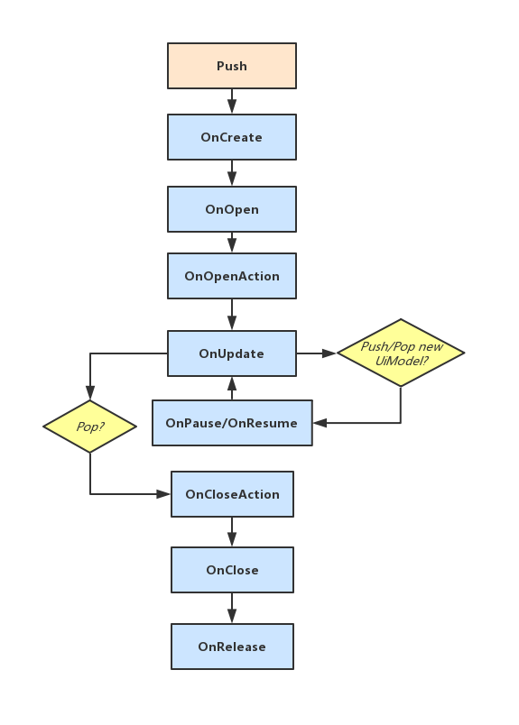

这是一个非常非常Pure的UI框架,很适合小型项目,在我写的项目中,经过大量的UI开发,这个框架稳定,易用并满足需求.

- 设计  
- UI生命周期  
- UiModel类  
- UiStack类  
- 使用

<!-- more -->

## 设计  
1.UI的打开和关闭需要统一接口,便于调试和管理 
2.UI打开和关闭可能会有动画效果,关闭效果播完然后才删除  
3.当打开新的UI后,下层UI可以得到通知,相应的,当关闭UI时,下层UI也会得到通知  
4.UI本身是可以支持跳转到其他UI的,所以支持自身直接打开新的UI,或者关闭UI 

## UI生命周期  



**`void OnCreate()`** push时立即调用,一般在此方法中获取自身组件,处理自身初始化状态等自身相关操作  
**`void OnOpen()`** 用于初始化,注册消息,添加监听等涉及到外部类的状态的操作   
**`void OnOpenAction()`** 发生在OnOpen之后,在此方法中写打开动画的代码  
**`void OnUppublished()`** 每帧调用  
**`void OnPause()`** 当有新的界面被Push时调用,当前界面失去焦点,此方法处理一些需要暂停的操作  
**`void OnResume()`** 当新的界面被Pop时调用,当前界面变为焦点,恢复刚刚暂停的操作  
**`float OnCloseAction()`** 自身被Pop时调用,用于执行关闭的动画,返回动画需要的时间,时间过后会删除自身  
**`void OnClose()`** 关闭界面,用于释放资源,注销消息,删除监听等操作  
**`void OnRelease()`** 被Destroy时调用  

## UiModel类  

约束生命周期的UI基类,具体的UI类去继承它,实现需要的生命周期方法  

这个类中,将Unity自带的`Awake`,`Start`,`OnDestroy`,`Uppublished`实现了,一方面是不希望子类再去实现这些方法(子类再实现这些方法会出现警告),另一方面将方法转发给对应的生命周期函数,这样也是便于管理 

结合`UiStack`类,每个`UiModel`都会存在于一个`UiStack`类中,因此获取到对方的引用将有利于一些操作,当然不希望外部去使用,作为private对象 
这样一来,可以提供`Close`方法和`PushUI`方法,这样可以让具体的子类UI无需再获取到`UiStack`就可以打开新的界面和关闭自身界面

```CSharp
using UnityEngine;
using UnityEngine.UI;

[RequireComponent(typeof(RectTransform))]
public class UiModel : MonoBehaviour {

    private UiStack _uiStack = null;

    protected void Awake() {
        OnCreate();
    }

    protected void Start() {
        OnOpen();
        OnOpenAction();
    }

    protected void OnDestroy() {
        OnRelease();
    }

    protected void Uppublished() {
        OnUppublished();
    }

    public UiModel PushUI(GameObject prefab) {
        if (!_uiStack) { return null; }
        return _uiStack.Push(prefab);
    }

    public T PushUI<T>(GameObject prefab) where T : UiModel {
        return PushUI(prefab) as T;
    }

    public void Close() {
        if (_uiStack) {
            _uiStack.Pop();
        }
    }

    public void _BindUiStack(UiStack uiStack) {
        _uiStack = uiStack;
    }

    // =================== life circle ===================

    public virtual void OnCreate() { }
    public virtual void OnOpen() { }
    public virtual void OnOpenAction() { }

    public virtual void OnPause() { }
    public virtual void OnResume() { }

    public virtual void OnUppublished() { }
    public virtual float OnCloseAction() { return 0; }
    public virtual void OnClose() { }
    public virtual void OnRelease() { }

    // ====================== end =====================
}
```

## UiStack类

这是一个Ui栈,主要就是管理`UiModel`
主要方法就是`Push`,`Pop`

`UiModel Push(GameObject prefab)`传入一个事先制作好的UI Prefab,打开这个UI并返回`UiModel`对象
`void Pop()`弹出当前焦点UI

```csharp
using System.Collections.Generic;
using UnityEngine;
using UnityEngine.UI;

[RequireComponent(typeof(Canvas))]
[RequireComponent(typeof(CanvasScaler))]
[RequireComponent(typeof(CanvasGroup))]
[RequireComponent(typeof(GraphicRaycaster))]
[RequireComponent(typeof(RectTransform))]
public sealed class UiStack : MonoBehaviour {

    private RectTransform _rectTransform = null;
    private LinkedList<UiModel> _uiStack = new LinkedList<UiModel>();

    public Canvas canvas { get; private set; }

    private void Awake() {
        _rectTransform = GetComponent<RectTransform>();
        canvas = GetComponent<Canvas>();
    }

    private void OnDestroy() {
        Clear();
    }

    public UiModel Push(GameObject prefab) {
        if (!prefab) {
            Debug.LogError("The prefab is null!");
            return null;
        }
        if (!prefab.GetComponent<UiModel>()) {
            Debug.LogError("It's not a UiModel object!");
            return null;
        }

        var last = (_uiStack.Last != null) ? _uiStack.Last.Value : null;
        if (last) {
            last.OnPause();
        }

        var model = _InstantiateModel(prefab);
        _uiStack.AddLast(model);
        model._BindUiStack(this);
        return model;
    }

    public T Push<T>(GameObject prefab) where T : UiModel {
        return Push(prefab) as T;
    }

    public void Pop() {
        if (_uiStack.Last == null) { return; }
        var model = _uiStack.Last.Value;
        _uiStack.RemoveLast();
        if (model) {
            model._BindUiStack(null);
            var delay = model.OnCloseAction();
            var last = (_uiStack.Last != null) ? _uiStack.Last.Value : null;
            if (last) {
                last.OnResume();
            }
            model.OnClose();
            Destroy(model.gameObject, delay);
        }
    }

    public void Clear() {
        while (_uiStack.Last != null) {
            Pop();
        }
    }

    public void Pause() {
        var last = (_uiStack.Last != null) ? _uiStack.Last.Value : null;
        if (last) {
            last.OnPause();
        }
    }

    public void Resume() {
        var last = (_uiStack.Last != null) ? _uiStack.Last.Value : null;
        if (last) {
            last.OnResume();
        }
    }

    private UiModel _InstantiateModel(GameObject prefab) {
        var modelObj = Instantiate(prefab, _rectTransform);
        modelObj.name = prefab.name;
        var modelTransform = modelObj.GetComponent<RectTransform>();
        modelTransform.localScale = Vector3.one;
        modelTransform.localPosition = Vector3.zero;
        var model = modelObj.GetComponent<UiModel>();
        return model;
    }
}
```

